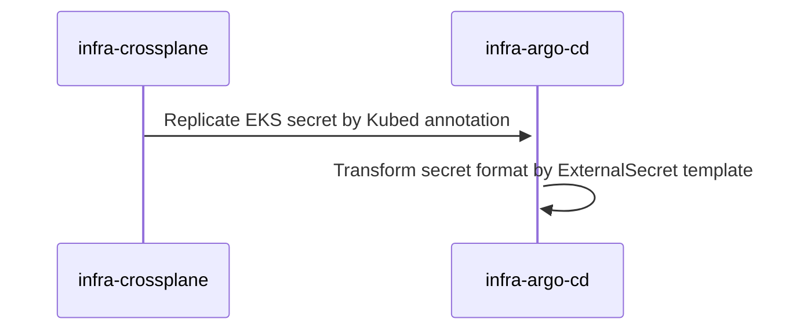

# Argo CD Module Chart

## TL;DR

## Introduction

## Prerequisites

- Kubernetes 1.19+
- Helm 3.2.0+

## Using the Chart
## Cluster secret workflow


## Parameters

### Global parameters

| Name                              | Description                                                                                                      | Value                            |
| --------------------------------- | ---------------------------------------------------------------------------------------------------------------- | -------------------------------- |
| `global.chartNameOverride`        | Overrides the chart name.                                                                                        | `""`                             |
| `global.releaseNameOverride`      | Overrides the release name.                                                                                      | `""`                             |
| `global.tags`                     | Define common tags for all IAC and app resources generated by this chart.                                        | `{}`                             |
| `global.labels`                   | Define common labels for all IAC and app resources generated by this chart.                                      | `{}`                             |
| `global.annotations`              | Define common annotations for all IAC and app resources generated by this chart.                                 | `{}`                             |
| `global.awsAccountId`             | Default aws account id for crossplane aws provider resources. Quotes are important, value must be a string.      | `0123456789`                     |
| `global.awsMgmtAccountId`         | Default aws account id of the main crossplane management instance. Quotes are important, value must be a string. | `00000000000`                    |
| `global.awsRegion`                | Default aws region for crossplane aws provider resources.                                                        | `us-east-2`                      |
| `global.eksHash`                  | Default EKS cluster hash for relevant crossplane resources such as IAM Role.                                     | `XXXXX`                          |
| `global.eksClusterName`           | Default EKS cluster hash for relevant crossplane resources such as IAM Role.                                     | `infra-aws-eks`                  |
| `global.providerConfigRef.name`   | Default crossplane provider all resources generated for crossplane.                                              | `crossplane-provider-config-aws` |
| `global.awsDeletionPolicy`        | Default crossplane deletion policy for all resources deployed by this helm chart..                               | `Orphan`                         |
| `global.secretStoreRef`           | External Secrets secret store ref to fetch AWS secret for repo creds                                             | `cluster-secret-store-aws`       |
| `global.githubOrg`                | Github Org for accessing repos using github app                                                                  | `satish-labs`                    |
| `global.environment`              | Used for identifying secret path in the AWS secrets                                                              | `dev`                            |
| `global.team`                     | Used for identifying secret path in the AWS secrets                                                              | `infra`                          |
| `global.ingressUrl`               | Ingress URL to use for additional ingress.                                                                       | `argo-cd.dev.domain.com`         |
| `global.ingressClassNameExternal` | External facing ingress class name, used for webhooks                                                            | `nginx-ingress-external`         |
| `global.ingressClassNameInternal` | Internal facing ingress class name for argocd UI                                                                 | `nginx-ingress-internal`         |
| `global.certIssuer`               | External Secrets secret store ref to fetch AWS secret for repo creds                                             | `dev-satishweb-com`              |

### ArgoCDExtension


### crossplane-aws-iam


### argo-cd


### common-res


### external-secrets


## Configuration and installation details


## Troubleshooting
### Objects to remove after removing argo-cd

```shell
kubectl ns infra-argo-cd

for i in $(kubectl get applications|grep -v NAME|cut -f1 -d' '); do kubectl patch applications $i -p '{"metadata":{"finalizers":[]}}' --type=merge; done
for i in $(kubectl get appprojects.argoproj.io|grep -v NAME|cut -f1 -d' '); do kubectl patch appprojects.argoproj.io $i -p '{"metadata":{"finalizers":[]}}' --type=merge; done
for i in $(kubectl get applicationsets.argoproj.io|grep -v NAME|cut -f1 -d' '); do kubectl patch applicationsets.argoproj.io $i -p '{"metadata":{"finalizers":[]}}' --type=merge; done

for i in $(kubectl get applications|grep -v NAME|cut -f1 -d' '); do kubectl delete application $i; done
for i in $(kubectl get appprojects.argoproj.io|grep -v NAME|cut -f1 -d' '); do kubectl delete appprojects.argoproj.io $i; done
for i in $(kubectl get applicationsets.argoproj.io|grep -v NAME|cut -f1 -d' '); do kubectl delete applicationsets.argoproj.io $i; done

kubectl delete clusterrole $(kubectl get clusterrole|grep 'argocd'|awk '{print $1}')
kubectl delete clusterRoleBinding $(kubectl get clusterRoleBinding|grep 'argocd'|awk '{print $1}')
kubectl delete crd applications.argoproj.io applicationsets.argoproj.io appprojects.argoproj.io argocdextensions.argoproj.io
kubectl delete namespace infra-argo-cd
```

## Notable changes
