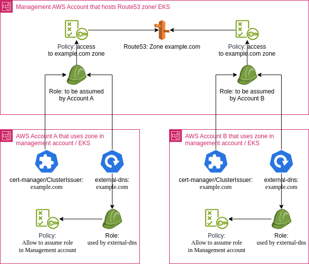

# Cross-Account DNS Zone Management Module Chart - Host Part

Module shold allow sharing/using Route53-hosted DNS zone between AWS accounts.

## TL;DR

## Introduction

## Prerequisites

- Kubernetes 1.19+
- Helm 3.2.0+

## Using the Chart

## Parameters

### Global parameters

| Name                               | Description                                                                                                 | Value            |
| ---------------------------------- | ----------------------------------------------------------------------------------------------------------- | ---------------- |
| `global.chartNameOverride`         | Overrides the chart name.                                                                                   | `""`             |
| `global.releaseNameOverride`       | Overrides the release name.                                                                                 | `""`             |
| `global.tags`                      | Define common tags for all IAC and app resources generated by this chart.                                   | `{}`             |
| `global.labels`                    | Define common labels for all IAC and app resources generated by this chart.                                 | `{}`             |
| `global.annotations`               | Define common annotations for all IAC and app resources generated by this chart.                            | `{}`             |
| `global.providerConfigRef.name`    | Default crossplane provider all resources generated for crossplane.                                         | `aws-0123456789` |
| `global.awsAccountId`              | Default aws account id for crossplane aws provider resources. Quotes are important, value must be a string. | `0123456789`     |
| `global.awsRegion`                 | Default aws region for crossplane aws provider resources.                                                   | `us-west-2`      |
| `global.zoneName`                  | Default allowed record names.                                                                               | `example.com.`   |
| `global.clientAwsAccountId`        | Id of the AWS Account that is trying to obtain access to shared DNS zone.                                   | `9876543210`     |
| `global.clientExternalDnsRoleName` | Role name used by client's external-dns to access shared DNS zone.                                          | `tenant-role`    |
| `global.clientCertManagerRoleName` | Role name used by client's cert-manager to access shared DNS zone.                                          | `tenant-role`    |

### AWS IAM configurations

## Configuration and installation details

## Troubleshooting

## Notable changes
